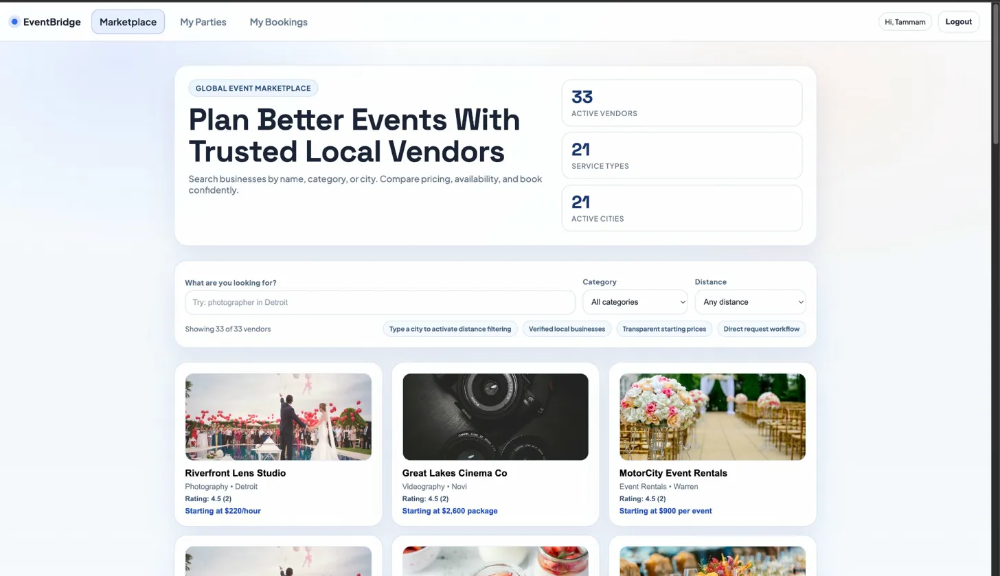
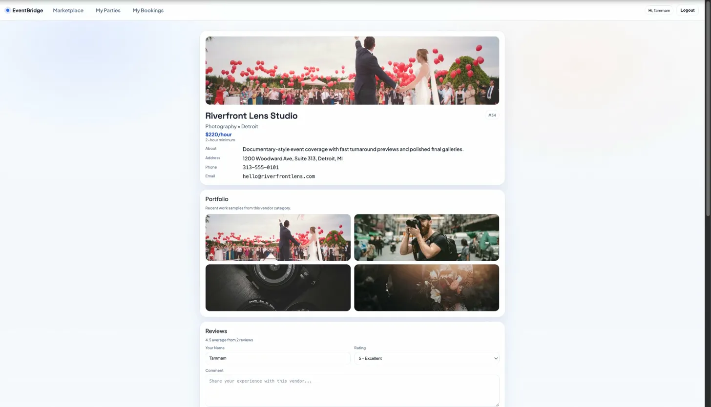
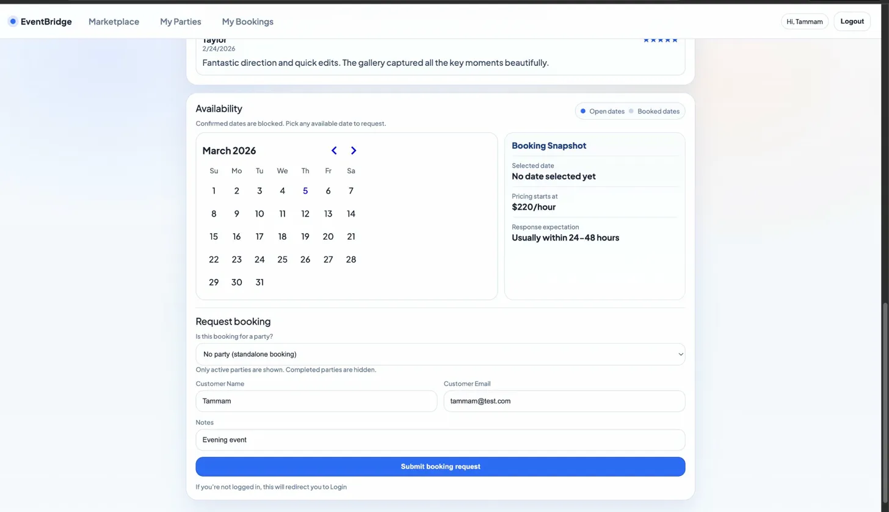
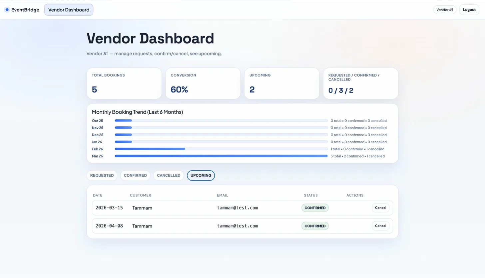

# 📅 EventBridge

A full-stack marketplace platform for booking event vendors with calendar scheduling, reviews, analytics, and a structured booking lifecycle built using Spring Boot and PostgreSQL.

---

## Demo

### Marketplace


### Vendor Profile


### Customer Booking Interface


### Vendor Dashboard


---

## Overview

EventBridge solves a real coordination problem in event planning: customers often have to call multiple vendors to check availability and confirm bookings manually.

This platform allows customers to browse vendors by category, city, or name with optional distance-based filtering using geographic coordinates — then submit booking requests directly through a calendar-based interface. Vendors manage those requests from a dedicated dashboard with booking analytics and lifecycle controls.

The React frontend provides separate views for customers and vendors, reflecting booking state changes dynamically without page reloads.

The backend enforces booking state integrity using a layered architecture. Requests move through a controlled lifecycle (request → confirm → cancel) with relational constraints and service-layer validation preventing duplicate bookings for the same vendor and availability slot while also blocking invalid state transitions.

---

## Features

- 🏪 **Vendor Marketplace** — Browse vendors by name, category, or city with optional distance-based filtering
- 👤 **Vendor Profiles** — Each vendor has a profile page with portfolio gallery, pricing, contact info, and customer reviews
- ⭐ **Reviews & Ratings** — Customers can leave ratings and comments on vendors they've worked with
- 📅 **Calendar-Based Booking** — Customers select available dates from a live calendar showing open and booked slots
- 🧾 **Vendor Dashboard** — Vendors manage incoming requests with accept/decline controls and view booking history
- 📊 **Booking Analytics** — Dashboard displays conversion rate, total bookings, upcoming confirmed bookings, and a 6-month booking trend chart
- 🔄 **Booking Lifecycle Management** — Requests move through controlled states (request → confirm → cancel)
- 🧠 **Service-Layer Validation** — Backend prevents invalid state transitions and duplicate bookings for the same vendor and availability slot
- ⚡ **Dynamic UI Updates** — React frontend reflects booking status changes without page reload
- 🗃️ **Relational Data Modeling** — Vendors, bookings, availability slots, and reviews modeled through normalized PostgreSQL tables
- 🔌 **REST API Architecture** — Frontend communicates with backend through structured REST endpoints

---

## Tech Stack

| Layer | Technology |
|-------|------------|
| Backend | Java, Spring Boot, Spring Data JPA |
| Database | PostgreSQL |
| Frontend | React, JavaScript |
| Architecture | Controller → Service → Repository |
| API | RESTful endpoints |

---

## Architecture

The backend follows a strict layered architecture:

```
Controller → Service → Repository → Database
```

**Controller Layer** — Handles HTTP requests and exposes REST API endpoints for booking creation, retrieval, and state updates.

**Service Layer** — Contains business logic including booking lifecycle management and validation rules to prevent invalid state transitions or duplicate bookings for the same vendor and availability slot.

**Repository Layer** — Uses Spring Data JPA to manage persistence and relational data operations with PostgreSQL.

This separation keeps business logic independent of HTTP or database implementation details, improving maintainability and testability.

---

## API Endpoints

| Method | Endpoint | Description |
|--------|----------|-------------|
| `GET` | `/vendors` | Retrieve available vendors |
| `GET` | `/bookings` | Retrieve booking requests |
| `POST` | `/bookings` | Create a new booking request |
| `PUT` | `/bookings/{id}/confirm` | Confirm a booking request |
| `PUT` | `/bookings/{id}/cancel` | Cancel a booking request |
| `GET` | `/vendors/{id}/reviews` | Retrieve reviews for a vendor |
| `POST` | `/vendors/{id}/reviews` | Submit a review for a vendor |

---

## Data Model

```
Vendor
------
id
name
category
city
pricing
contact

Booking
-------
id
vendor_id
customer_name
customer_email
status
date
created_at

AvailabilitySlot
----------------
id
vendor_id
date
status

Review
------
id
vendor_id
customer_name
rating
comment
created_at
```

Relational constraints ensure bookings remain tied to valid vendors and availability slots, preventing orphaned records and duplicate bookings for the same time slot.

---

## Project Structure

```
eventbridge/
├── backend/
│   ├── controller/
│   ├── service/
│   ├── repository/
│   ├── model/
│   └── config/
│
├── frontend/
│   ├── components/
│   ├── pages/
│   └── api/
│
└── README.md
```

---

## Running Locally

> **Note:** Requires a running PostgreSQL instance. Update `application.properties` in the backend with your database credentials before running.

**Clone the repository**

```bash
git clone https://github.com/tammamahad/eventbridge.git
cd eventbridge
```

**Run the backend**

```bash
cd backend
./mvnw spring-boot:run
```

Backend starts at `http://localhost:8080`

**Run the frontend**

```bash
cd frontend
npm install
npm run dev
```

Frontend starts at `http://localhost:5173`

---

## What I Learned

The most interesting challenge in this project was designing a booking lifecycle that maintains data integrity across multiple actors.

Rather than allowing arbitrary updates to booking records, the backend enforces controlled state transitions through the service layer — bookings can only move through valid states (request → confirm → cancel). This prevents race conditions and invalid data from ever reaching the database.

Designing the relational schema also required careful thought about how vendors, availability slots, bookings, and reviews all interact — and how to prevent duplicate bookings for the same time slot through database constraints rather than relying solely on application logic.

This project deepened my understanding of layered backend architecture, relational modeling, and building APIs that support real-world transactional workflows.

---

## Future Improvements

- Authentication and role-based access control for vendors and customers
- Payment integration for confirmed bookings
- Cloud deployment with managed PostgreSQL database
- Notification system for booking updates

---

## Author

**Tammam Ahad** — Computer Science, Wayne State University  
GitHub: [@tammamahad](https://github.com/tammamahad)
