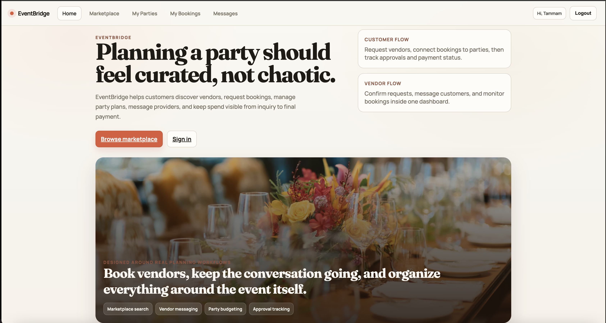
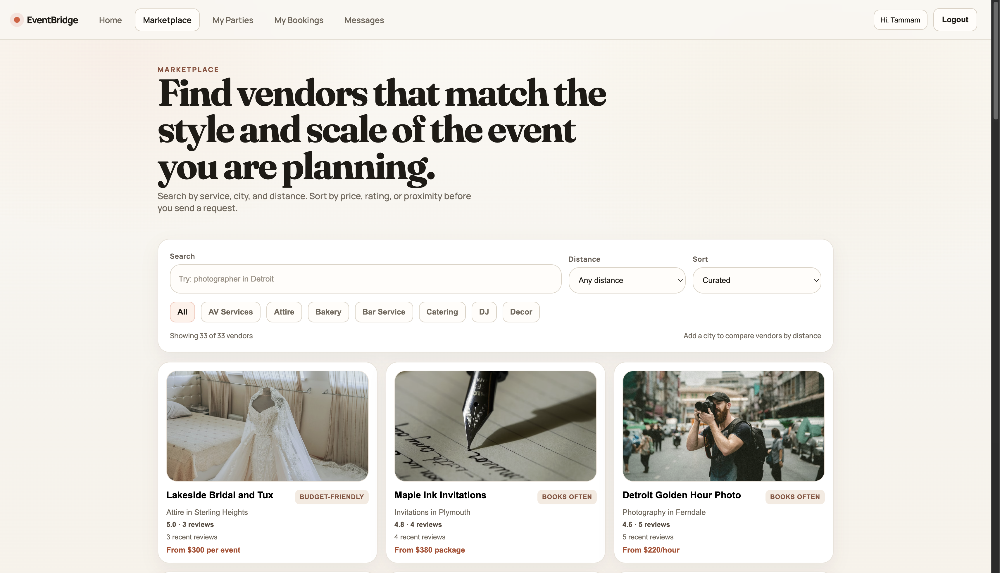
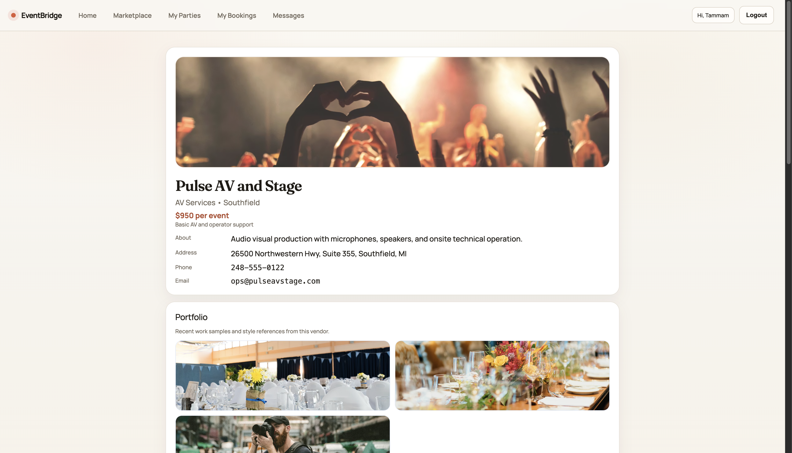
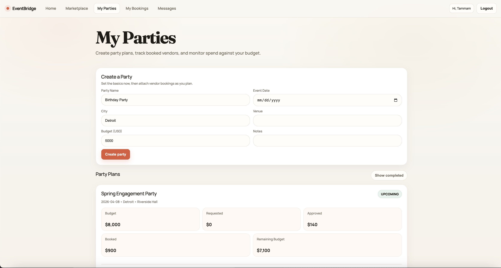
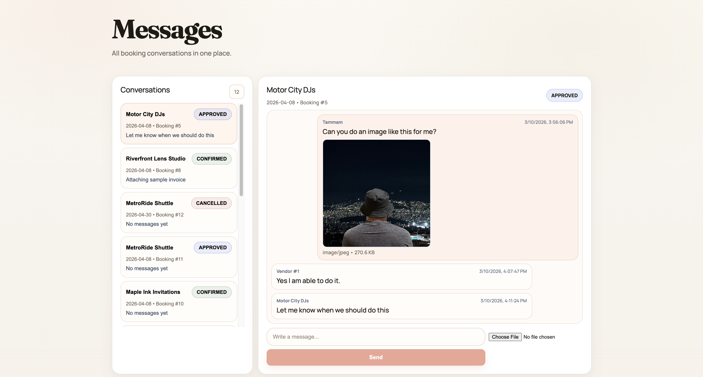
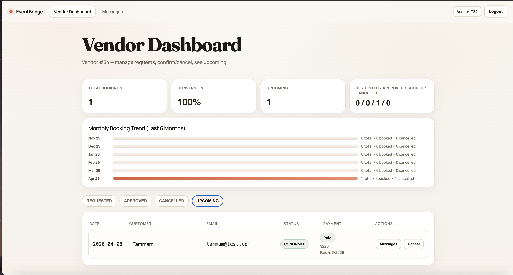

# 📅 EventBridge

A full-stack two-sided marketplace for booking event vendors. Customers browse vendors, request bookings, track spending against a party budget, message vendors, and pay confirmed bookings — all in one place.

Built with Spring Boot, PostgreSQL, and React using a layered architecture designed for real-world transactional workflows.

---

## 🚀 Key Highlights

- Full-stack marketplace with customer + vendor workflows  
- Enforced booking lifecycle using a backend state machine  
- Real-time messaging system with file support  
- Budget tracking + mock payment integration  
- PostgreSQL constraints preventing double-booking  

---

## 📸 Demo

### Home

### Marketplace

### Vendor Profile & Booking

### My Parties — Budget Tracker

### Messaging

### Vendor Dashboard

---

## 🧾 Overview

EventBridge solves a real coordination problem in event planning: managing multiple vendors across separate conversations with no centralized view of booking status or spending.

This platform allows customers to browse vendors, request bookings, communicate directly, and track budgets — while vendors manage requests and monitor analytics from a dedicated dashboard.

The backend enforces strict booking lifecycle rules and relational integrity using service-layer validation and database constraints.

---

## ✨ Features

### 🏪 Marketplace & Discovery
- Browse vendors by name, category, or city
- Dynamic filtering with responsive UI

### 👤 Vendor Profiles
- Portfolio images, pricing, and contact details
- Reviews and ratings

### 📅 Booking System
- Calendar-based booking requests
- Prevents duplicate bookings per vendor/date
- Controlled lifecycle:
  REQUESTED → APPROVED → CONFIRMED → CANCELLED

### 💬 Messaging System
- Real-time messaging between customers and vendors
- Supports file attachments

### 🧾 Vendor Dashboard
- Accept or decline booking requests
- View booking history and upcoming events

### 📊 Analytics
- Conversion rate tracking
- Booking trends and upcoming events

### 💳 Payment Flow
- Mock checkout system
- Tracks payment state (`UNPAID → PAID`)
- Automatically confirms bookings after payment

### 🧠 Data Integrity
- Service-layer validation for lifecycle enforcement
- Database-level constraints to prevent double-booking

---

## 🛠️ Tech Stack

| Layer | Technology |
|------|-----------|
| Backend | Java 17, Spring Boot, Spring Data JPA |
| Database | PostgreSQL |
| Frontend | React, JavaScript, Vite |
| Styling | CSS |
| API | REST |

---

## 🧱 Architecture

Controller → Service → Repository → Database

- Controller: Handles HTTP requests  
- Service: Business logic, lifecycle validation, messaging  
- Repository: Database operations using JPA  

---

## 🔌 API Endpoints

| Method | Endpoint | Description |
|--------|----------|-------------|
| GET | /vendors | List vendors |
| GET | /vendors/{id} | Vendor profile |
| POST | /bookings | Create booking |
| PATCH | /bookings/{id}/confirm | Confirm booking |
| PATCH | /bookings/{id}/cancel | Cancel booking |
| PATCH | /bookings/{id}/pay | Process payment |
| GET | /messages/booking/{id} | Get messages |
| POST | /messages/booking/{id} | Send message |

---

## 🗃️ Data Model

Vendor  
Booking  
Party  
Review  
BookingMessage  

Key relationships:
- Vendor → Bookings (1:N)
- Booking → Messages (1:N)
- Vendor → Reviews (1:N)

---

## 📁 Project Structure

eventbridge/
- src/main/java/... (Spring Boot backend)
- frontend/ (React frontend)
- scripts/ (seed data)

---

## ⚙️ Running Locally

Clone the repo:
git clone https://github.com/tammamahad/eventbridge.git
cd eventbridge

Run backend:
./mvnw spring-boot:run  
http://localhost:9090

Run frontend:
cd frontend  
npm install  
npm run dev  
http://localhost:5173

---

## 🧠 What I Learned

- Designing a state-driven booking lifecycle to prevent invalid transitions  
- Enforcing data integrity using both application logic and database constraints  
- Managing relationships between bookings, parties, and vendors  
- Building a full-stack system with synchronized frontend and backend state  

---

## 🔮 Future Improvements

- Authentication (JWT / role-based access)  
- Real payment integration (Stripe)  
- Notifications (email or in-app)  
- Cloud deployment  
- AI-based vendor recommendations  

---

## 👨‍💻 Author

Tammam Ahad  
Computer Science — Wayne State University  

https://github.com/tammamahad
